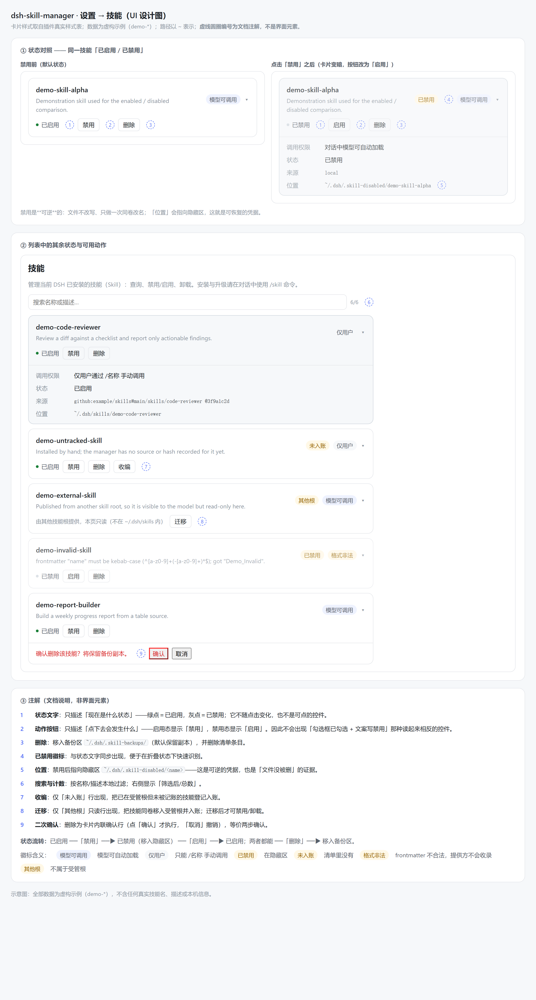
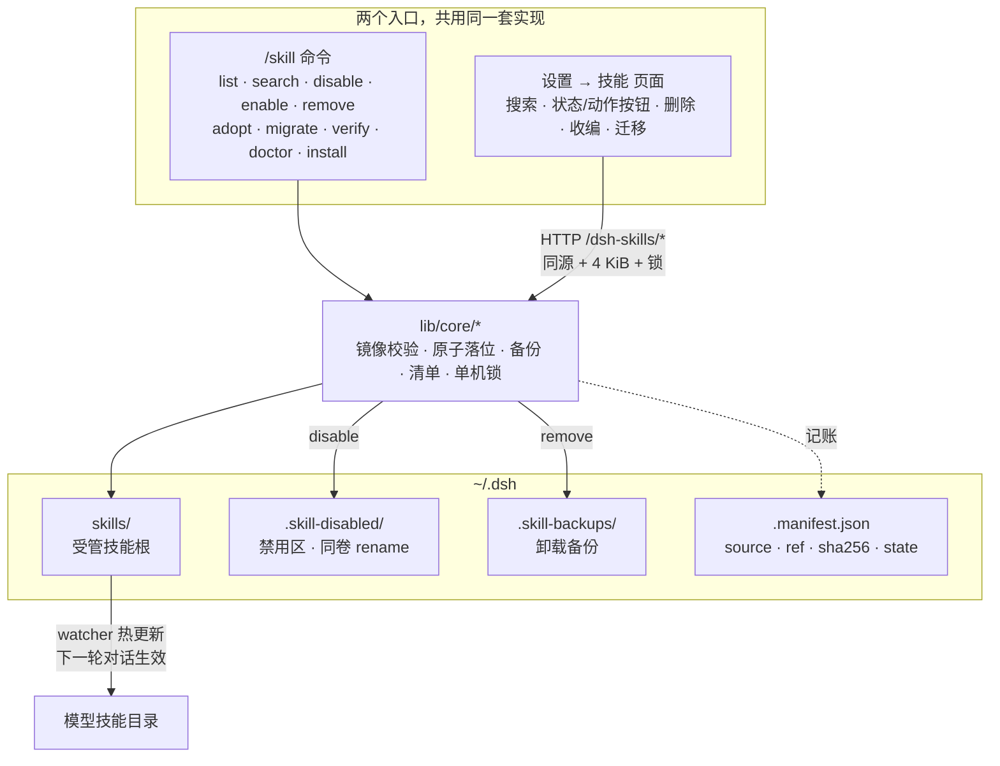
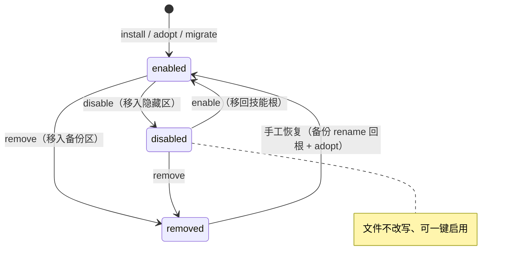

# dsh-skill-manager

DSH 已安装技能的管理器：**查询（含本地搜索）、启用/禁用、卸载**。
安装与升级仍走 `/skill install` 命令；本插件的页面**不做互联网检索、不做市场、不做在线安装**。

A local manager for skills already installed in a DeepSeek Harness deployment:
list & search, enable/disable and remove — from the `/skill` command group and
from **设置 → 技能**. It deliberately does not search the internet for skills.

## 功能 / What it does

| 能力 | 命令 | 页面 |
|---|---|---|
| 清单 + 本地搜索 | `/skill list` · `/skill search <text>` | 顶部搜索框（按名称/描述过滤） |
| 禁用 / 启用 | `/skill disable <name>` · `/skill enable <name>` | 每张卡片的「已启用/已禁用 + 动作按钮」 |
| 卸载（保留备份） | `/skill remove <name> [--purge]` | 卡片上的「删除」+ 二次确认 |
| 收编未入账技能 | `/skill adopt <name> [--source <spec>]` | 未入账卡片的「收编」 |
| 迁移其他根的技能 | `/skill migrate [<name>] [--dry-run]` | 其他根只读卡片的「迁移」（迁入受管根后即可禁用/卸载） |
| 本地完整性校验 | `/skill verify [<name>]` | — |
| 诊断 | `/skill doctor` | —（技能根/隐藏区/清单/未入账/缺失/其他根 + **接线状态** + **客户端契约自检**） |
| 安装（命令侧） | `/skill install <spec> [--force]` | 页面**不提供**安装入口 |
| 更新 | 暂不支持（近期范围外） | — |

## 它长什么样 / What the page looks like



页面沿用 DSH 设置面板的「技能」席位。三条交互规则：

- **状态用文字描述**：绿点＝已启用、灰点＝已禁用——它只说明"现在是什么状态"，不是控件；
- **按钮描述动作**：已启用→「禁用」，已禁用→「启用」；另有「删除」（内联二次确认）、「收编」（未入账行）、「迁移」（其他根只读行）；
- **禁用是可逆的**：文件不改写，只做一次同卷改名，路径可在展开详情里看到。

> 图中虚线圆圈编号为**文档注解**，不是界面元素；图片由 `tools/render-ui-mock.ps1` 用插件的真实样式表生成，
> 可随 UI 改动一键重出（见 [开发](#开发--development)）。示例数据全部为虚构 `demo-*`。

## 架构一览 / How it fits together



命令平面与页面**调用同一批 `lib/core/*` 函数**，因此两个入口不可能出现状态分歧；页面走的是本插件自注册在
宿主 webServer 上的 `/dsh-skills/*` 本地路由（同源校验 + 4 KiB 请求体上限 + 与命令共用的一把锁）。

## 安装 / Install

插件自带 `dsh.bundle.patch`，走官方通道即可自动挂载（无需手写 profile patch）：

```bash
# Windows
dsh plugin --profile web add file:D:/DSH/dsh-skill-manager

# macOS / Linux
dsh plugin --profile web add file:$HOME/dev/dsh-skill-manager

# 或从 git（两种系统都一样）
dsh plugin --profile web add git+https://github.com/<owner>/dsh-skill-manager.git
```

安装后 `dsh.profile.bundles` 会自动包含本包；**重启一次 `dsh web`** 生效。
若 profile 的 `cordis.patch.yml` 里存在同 id（`dsh-skill-manager`）的手写 insert，
必须先删除，否则重复 entry id 会导致 cordis 拒绝启动。

> ⚠️ **务必用 `file:` 或 `git+https://` 这两个 spec 安装，不要写裸包名。**
> npm 上 `dsh-skill-manager` 这个名字属于**第三方**（maintainer `gohana`，2026-08-13 起，v0.1.0–0.1.3），
> 裸名 `dsh plugin --profile web add dsh-skill-manager` 会装到别人的包。
> 如果本插件将来要发布到 npm，需要一个**未被占用的名字**（例如带 scope 的 `@<你的账号>/dsh-skill-manager`）。

## macOS / Linux

核心与平台无关（纯 Node ESM、零运行时依赖），工具链两套等价实现，CI 在
`ubuntu-latest` / `macos-latest` / `windows-latest` 上跑**同一批测试**：

| 用途 | macOS / Linux | Windows |
|---|---|---|
| 换装（备份→卸旧→清 patch→装新→预检） | `bash tools/swap-profile.sh`（先加 `--dry-run`） | `powershell -ExecutionPolicy Bypass -File tools\swap-profile.ps1` |
| 改代码后重快照 | `bash tools/resync-profile.sh` | `powershell -ExecutionPolicy Bypass -File tools\resync-profile.ps1` |
| 重出 README 设计图 | `bash tools/render-ui-mock.sh` | `powershell -ExecutionPolicy Bypass -File tools\render-ui-mock.ps1` |
| 重启 dsh web | 在其终端 `Ctrl+C` 后重新启动 | 同左（`start-dsh-web.ps1` 只是 Windows 便捷脚本） |

路径对照：受管根 `~/.dsh/skills`、禁用区 `~/.dsh/.skill-disabled`、备份区 `~/.dsh/.skill-backups`、
其他根 `~/.agents/skills`（可用 `/skill migrate` 迁入）；staging 走 `os.tmpdir()`（macOS 上即 `$TMPDIR`）。
前置条件：Node ≥ 20、`git`（安装/迁移用）；`pnpm` 由 `dsh plugin` 转发调用。

**macOS 上的一条特有注意**：**符号链接的技能不会被收录**——提供方按 lstat 语义读取条目
（`dsh-fs-local` 把链接报告为 `symlink`），只接受真实目录或 `.md` 文件，因此
「把开发仓库 symlink 进 `~/.dsh/skills`」不会生效。管理器不会假装它可用：列表里标为**符号链接**、
`doctor` 也会单列出来，想启用请改成真实拷贝（或从其他根 `/skill migrate` 迁入）。

## 禁用是怎么实现的 / How disabling works

技能提供方只发现技能根的**直接子项**。禁用即把技能从
`~/.dsh/skills/<name>/` 移到**同级隐藏区** `~/.dsh/.skill-disabled/<name>/`
（与 `.skill-backups` 对称、同卷原子 rename）：目录里立刻不再出现该技能，
文件原样保留，启用就是移回来。任何内容都不会被改写，因此禁用后的文件与安装时逐字节一致。

watcher 是异步的（chokidar `atomic` 延迟 100 ms、目录 readdir 1 s 节流），
所以两个入口都承诺「**下一轮对话起生效**」，不会假装即时生效。



## 数据来源 / Where the data comes from

- `~/.dsh/skills/.manifest.json` —— 账本：来源、commit、逐文件 sha256、启用状态。
  它是 `<root>/<name>/SKILL.md` 与 `<name>.md` 之外的第三种形态，提供方看不见它，
  写账本也不会触发目录重发。
- `~/.dsh/skills` —— 实际文件（权威）。
- `ctx.skills` —— 仅作为「模型目录是否可见」的旁证。

页面**不**使用 `remote.skills` 作为清单权威源：那条 RPC 按调用策略过滤，看不到已禁用、
仅模型可调用或未入账的技能——而这些正是管理器要管理的行。它只用来补齐**其他根**的技能
（如 `~/.agents/skills`），这些行标记「其他根」并保持**只读**，以保持与模型所见一致的查看体验。

换装步骤与验收清单见 [`docs/INSTALL-MIGRATION.md`](docs/INSTALL-MIGRATION.md)。
开发与交付的完整检测流程（三个真实事故复盘 + 七阶段可勾选清单 + 症状对照表）见工作区指引
**`D:\DSH\PLUGIN-DEV-CHECKLIST.md`**；本仓库的 `tests/` 与 `tools/` 就是该指引的参考实现。

## 结构 / Layout

```
dsh-skill-manager/
├── package.json          dsh.bundle.patch + dsh.client{platform:"web"}（双半区）
├── cordis.patch.yml      包内自挂载
├── lib/
│   ├── index.js          宿主：/skill 命令组 + 路由挂载 + 接线记录 + 图标自愈
│   ├── http.js           /dsh-skills/* 本地路由（同源校验 + 4 KiB body 上限）
│   ├── navicon.js        设置页「技能」图标自愈补丁
│   ├── selfcheck.js      客户端契约自检（doctor 消费）
│   ├── client.js         浏览器半区：设置 → 技能 页面
│   └── core/             唯一实现（命令与页面共用）
│       ├── paths.js  fsutil.js  lock.js  manifest.js
│       ├── source.js  validate.js  scan.js
│       ├── install.js    安装 / 卸载 / 校验
│       ├── migrate.js    其他根 → 受管根的迁移
│       └── state.js      启用 / 禁用 / 收编
├── tests/
│   ├── smoke.mjs         离线冒烟（临时技能根，不碰真实部署）
│   └── client-bundle.mjs 客户端 bundle 真实执行测试（含控件语义回归）
├── tools/
│   ├── preflight.mjs     重启前预检：重复 id / 入口可解析 / 入口存在 / BOM / 客户端契约 / 快照新鲜度
│   ├── profile-patch-clean.mjs 清理 profile 里指向已退役插件的 insert（两套安装脚本共用）
│   ├── ui-mock/          README 设计图的标记与样式抽取（mock.html + extract-css.mjs）
│   ├── render-ui-mock.ps1 / .sh   用真实样式表重出 docs/images/skills-page.png
│   ├── resync-profile.ps1 / .sh   改代码后重快照（remove + add + 预检）
│   └── swap-profile.ps1 / .sh     一键换装（备份→卸旧→清 patch→装新→预检），支持 dry run
├── .github/workflows/ci.yml  ubuntu / macos / windows × node 20/22 跑同一批测试
└── docs/                 PRD、评估报告、对齐方案、ADR、术语表、换装文档、设计图
```

## 开发 / Development

```bash
# 语法与两套离线测试（macOS/Linux 与 Windows 通用，CI 亦如此）
find lib tests tools -type f \( -name '*.js' -o -name '*.mjs' \) -exec node --check {} \;
node tests/smoke.mjs               # 宿主/核心全链路冒烟（92 项断言）
node tests/client-bundle.mjs       # 客户端 bundle 真实执行（29 项断言，含控件语义回归）

# 改过代码 → 重快照进 profile（会自动跑预检）
bash tools/resync-profile.sh                       # macOS / Linux
powershell -File tools\resync-profile.ps1          # Windows

# UI 有改动 → 重出 README 里的设计图（用真实样式表渲染）
bash tools/render-ui-mock.sh                       # macOS / Linux
powershell -File tools\render-ui-mock.ps1          # Windows
```

测试通过环境变量把整套路径指向临时目录，因此**永远不会**动到真实技能根：
`DSH_SKILL_MANAGER_SKILLS_ROOT`、`DSH_SKILL_MANAGER_MANIFEST_FILE`、
`DSH_SKILL_MANAGER_HIDDEN_DIR`、`DSH_SKILL_MANAGER_BACKUPS_DIR`、
`DSH_SKILL_MANAGER_STAGING_DIR`、`DSH_SKILL_MANAGER_FOREIGN_ROOTS`。

改完代码后重新快照到 profile 再重启（`pnpm` 对 `file:` 依赖只看路径，必须重装）：

```powershell
dsh plugin --profile web add file:D:/DSH/dsh-skill-manager   # 版本号变更后才会重快照
```

## 兼容性 / Compatibility

- 目标版本：dsh **0.1.5-rc.1**（`peerDependencies` 与同期 rc 对齐）。
- 客户端半区只 require 基座模块（`react`、`react/jsx-runtime`，可选
  `@deepseek-ai/dsh-client-ui-primitives`），不依赖任何业务命名空间——把
  dsh 升级导致的客户端契约漂移风险压到最低（0.1.5 升级曾使旧页面的
  `connection.api.*` 访问器失效）。
- 宿主半区不 import 任何 `@deepseek-ai` 包，只使用 `ctx.commands` / `ctx.skills` /
  可选 `ctx.webServer`。`webServer` 用嵌套注入，因此 `headless` / `tui` profile
  下插件仍可加载，只是没有页面路由。

## 已知限制 / Known limits

- 只管理用户根 `~/.dsh/skills`（rank 400）；项目根与 `~/.agents/skills` 的技能不在
  管理范围（后者计划迁移，见 `docs/M2-PLAN.md`）。
- 更新（`/skill update`）与 `verify --remote` 属远期；账本已记录 source/ref 以便将来生长。
- 跨卷移动被拒绝（隐藏区与技能根必须同卷），以免留下半成品。
