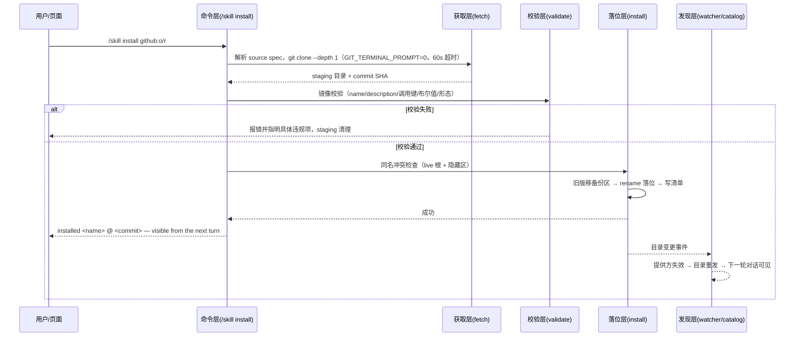
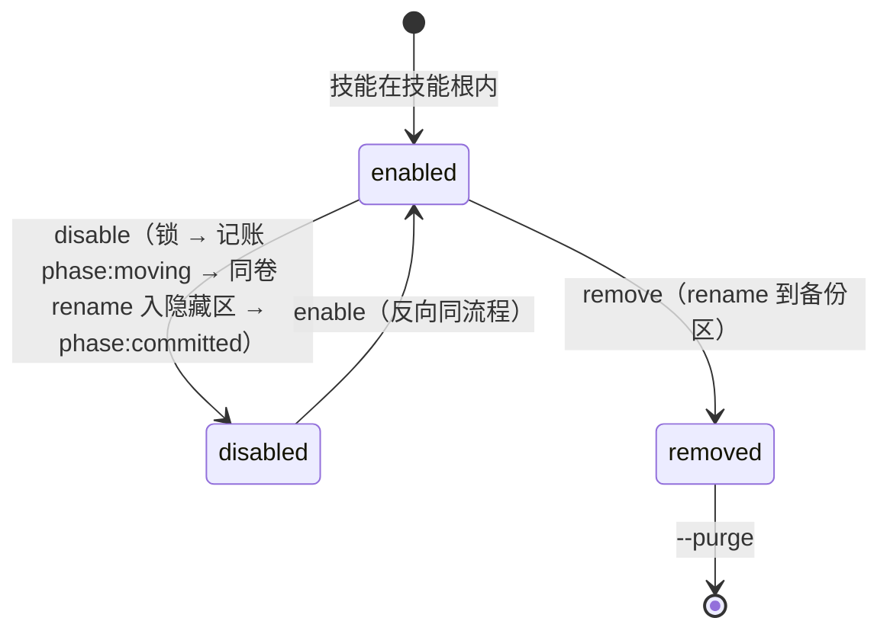

# 产品需求文档（PRD）：Skill 管理插件（dsh-skill-manager）

| 项 | 内容 |
|---|---|
| 文档版本 | **v2.0**（自 v1.1 全面改写：定位收敛 + 两插件合并 + 管理页面 + 标准插件交付） |
| 状态 | **已定稿（与 v0.1.4 代码对齐）** |
| 产品/项目 | DeepSeek Harness（DSH）插件 **`dsh-skill-manager`**（双半区标准插件；包名已脱离 `@deepseek-ai` 域） |
| 关联文档 | [PLAN-ALIGNMENT-v2.md](PLAN-ALIGNMENT-v2.md)（需求对齐与调查依据）、[EVALUATION-REPORT.md](EVALUATION-REPORT.md)（10 项裁决）、[INSTALL-MIGRATION.md](INSTALL-MIGRATION.md)（换装与验收清单）、[M2-PLAN.md](M2-PLAN.md)、[adr/](adr/)（ADR 0001-0006）、[CONTEXT.md](CONTEXT.md)（术语表） |
| 工作区流程指引 | `D:\DSH\PLUGIN-DEV-CHECKLIST.md`（插件交付前检测流程；本仓库 `tests/`+`tools/` 是其参考实现） |
| 评审方式 | grill-me + grill-with-docs 规程评审（见评估报告）；本版为实施后的代码对齐版 |

> **本版与 v1.1 的关系**：v1.1 的三条明文条款已被后续需求推翻（见 §1.4 与 §3），v2.0 按
> PLAN-ALIGNMENT-v2 §3「旧计划逐条 Review」的处置逐项改写，并按已落地代码标注实现状态。
> 状态标记：**✅ 已实现（v0.1.4）** / **⏳ 待实现** / **⛔ 非目标**。

---

## 1. 需求背景

### 1.1 技术背景：DSH 的 skill 四层体系（沿用 v1.1，仍然有效）

| 层 | 包 | 职责 |
|---|---|---|
| 注册表 | `@deepseek-ai/dsh-skill` | `ctx.skills`：合并各提供方、按 rank 决出同名胜者；**无 enable/disable/remove 语义** |
| 文件系统提供方 | `@deepseek-ai/dsh-skill-filesystem` | 扫描技能根、解析 frontmatter、Chokidar watcher 热更新；**发现深度只有一层** |
| 模型侧 | `@deepseek-ai/dsh-tool-skill` | 技能目录渲染 + `skill` 工具 |
| 用户侧 | `@deepseek-ai/dsh-client-ui-skill` | Web `/` 触发源 + 工具行 |

**「放对目录即安装」已内建**：提供方按 rank 扫描 `项目/.dsh/skills`(100)、`项目/.agents/skills`(200)、
自定义根(300)、`~/.dsh/skills`(400)、`~/.agents/skills`(500)；识别 `<name>/SKILL.md`（bundle）与
`<name>.md`（flat）两种形态；watcher 使变更在**下一轮对话**生效，无需重启。

### 1.2 痛点（沿用 v1.1 P1-P5）

- **P1 安装靠一次性脚本**：`download-skills.mjs` / `verify-skills.mjs` 硬编码路径，不可复用、不可审计。
- **P2 存量分散**：技能分布在 `~/.dsh/skills` 与 `~/.agents/skills` 两根，无统一视图与管理入口。
- **P3 静默丢弃**：提供方对非法 skill 名、驼峰调用键、非布尔调用值的行为是「警告后排除整个技能」，用户装完不生效且无解释。
- **P4 无记账**：装了什么、来自哪个 commit、能否升级，全无记录。
- **P5 无卸载/回滚**：删除靠手工，出错无备份可退。

### 1.3 定位澄清（v2.0 新增，2026-09-11 用户确认）

> 「我并不需要在这个管理功能里检索互联网上的 Skill，只需要能够搜索到当前 dsh 安装的 Skill……
> 这个插件的目的就是管理 dsh 已安装的 Skill，查询、禁用、卸载，未来可能需要支持更新，但近期不需要。」

| 维度 | 定位 |
|---|---|
| **UI 形态** | **参照**插件市场页的交互与视觉（卡片列表 / 状态 / 按钮 / 二次确认），因为那是用户已熟悉的范式 |
| **功能范围** | **仅本地已安装技能**：查询（列表 + 本地搜索过滤）、禁用/启用、卸载 |
| **明确非目标** | 互联网技能检索与索引、市场/商店页、在线评分或推荐、远程目录同步、页面内安装入口、zip/HTTP 归档源 |
| **收敛收益** | 无需处理网络失败与代理、无需维护远程索引契约、页面数据面完全落在本地文件系统与清单（离线可用） |

**架构结论：两个插件合并为一个包。** 原只读页面插件 `@deepseek-ai/dsh-client-ui-settings-skills`
的客户端半区（页面 UI/CSS/双语文案）与宿主半区的 navIcon 自愈补丁一并迁入新包，原包退役
（决策与理由见 [ADR-0005](adr/0005-dual-half-standard-plugin.md)）。交付物因此是**一个**标准插件。

### 1.4 目标（Goals）

- **G1** 把技能管理固化为 dsh 内的一等命令：`/skill list|search|disable|enable|remove|adopt|verify|doctor|install|migrate`。
- **G2** 操作具备**原子性、幂等性、可审计性**（来源 + commit + 逐文件 sha256 记账）。
- **G3** 校验规则与提供方**严格镜像**：凡装进去的必被发现；装不进去的必给出原因（消灭 P3）。
- **G4** 统一技能根到 `~/.dsh/skills`，存量迁移、收编入账。
- **G5** 技能操作**无需重启** `dsh web`（插件本身仅安装/换装时重启一次）。
- **G6**（v2 新增）提供**管理页面**：在「设置 → 技能」完成查询/搜索、启用禁用、卸载。
- **G7**（v2 新增）以**可交付的 DSH 标准插件**形态发布：`dsh.bundle.patch` + 双半区 + 官方安装通道。

### 1.5 非目标（Non-Goals）

- ⛔ **不给 DSH 上游贡献代码**（无上游仓库权限；npx 只读拷贝）—— 远期方向记录在案。
- ⛔ **不做互联网技能检索 / 市场 / 索引 / 在线安装入口**（§1.3）。
- ⛔ 不支持嵌套 skill 树、zip/HTTP 归档源（提供方本身刻意不支持嵌套发现）。
- ⛔ 不做多机同步与技能 registry。
- ⛔ v1 不管理项目根（`project-dsh`）；`--project` 经评审留 P2 候选，清单 `root` 字段已预留生长点。

> **删除的 v1.1 条款**：原 §1.4「**不做 client 半区管理 UI**：命令结果以文本渲染在 Web 命令面板，
> 设置页『技能』继续只读」已被 G6/R1 推翻——页面不再是只读，且由本插件承载。

---

## 2. 用户与使用场景

### 2.1 目标用户

| 角色 | 特征 |
|---|---|
| 个人用户（本人） | 单机、多 profile（web/headless）、常用 GitHub 开源技能与本地自建技能 |
| 协作者 | 通过仓库 README 获知「`dsh plugin --profile web add <spec>` 安装插件」「`/skill install <source>` 安装技能」 |

### 2.2 场景故事（Given / When / Then）

- **SC-01 从 GitHub 安装并立即使用**：`/skill install github:mattpocock/skills#main/skills/engineering/domain-modeling` → 命令面板返回「installed <name> @ <commit> — visible from the next turn」→ 下一轮对话技能目录出现该技能，**无需重启**。
- **SC-02 卸载**：页面点「删除」→ 卡片内联二次确认 → 技能移入备份区、清单删条目；`/skill remove <name> --purge` 连备份一并清除。
- **SC-03 校验完整性**：篡改 `SKILL.md` 后 `/skill verify <name>` → 逐文件 sha256 比对，列出 `modified/missing/extra`。
- **SC-04 存量迁移与收编**（✅ 已实现）：命令侧 `/skill migrate`（批量）或 `/skill migrate <name>`（单个）把 `~/.agents/skills` 等**外来根**的技能同卷 rename 进统一根并自动入账；页面侧在「其他根」只读卡片上提供「**迁移**」按钮 + 卡片内联二次确认。迁移后该技能即可禁用/卸载。
- **SC-05 环境诊断**：`/skill doctor` → 报告技能根、隐藏区、清单、未入账、缺失、其他根（附可迁移计数）、**接线状态（wiring）**与**客户端契约自检**。
- **SC-06 校验失败的显式反馈（消灭 P3）**：安装源 frontmatter 使用驼峰键 `disableModelInvocation` → 安装被拒，错误文本指明 canonical 拼写，已装内容毫发无损。
- **SC-07 页面查询与本地搜索**：打开 设置 → 技能 → 顶部搜索框输入 `grill` → 只剩 grilling / grill-me / grill-with-docs；`2/7` 计数显示过滤比。
- **SC-08 页面禁用/启用**：卡片显示「● 已启用 [禁用] [删除]」→ 点「禁用」→ 提示成功，卡片变「○ 已禁用 [启用] [删除]」；下一轮对话起模型目录不再含它；`~/.dsh/.skill-disabled/<name>/` 保存原文件。
- **SC-09 页面识别未入账技能**：手工放入的技能显示「未入账」徽标 + 「收编」按钮，点击后来源记为 `local` 并可被禁用/卸载。
- **SC-10 跨根只读可见**：`~/.agents/skills` 的技能在页面显示为「其他根」只读行（不可禁用/卸载），保证与模型所见一致。
- **SC-11 页面误操作防护**：删除必须经过二次确认；默认保留备份副本。

---

## 3. 需求范围与优先级

| 优先级 | 范围 | 状态 |
|---|---|---|
| **P0** | `install`（三类来源 + 校验镜像）、`list`、`remove`、清单记账、`disable`/`enable`、管理页面（查询/搜索/禁用/卸载）、标准插件打包 | ✅ 已实现 |
| **P1** | `adopt`、`verify`（本地）、`doctor`、存量迁移 | ✅ 已实现（`doctor` 另含接线状态与客户端契约自检） |
| **P2 候选** | `--project` 项目根、`/skill restore` 一键恢复、备份区自动清理策略、多机 manifest 同步、页面批量操作、无障碍审计 | ⏳ 待实现 |
| **远期** | `update`（升级）、`verify --remote`（联网对照上游） | ⏳ 待实现（用户明确近期不做） |
| **非目标** | 互联网检索/市场、页面内安装入口、zip/HTTP 源、上游贡献、嵌套技能树 | ⛔ |

---

## 4. 业务流程

### 4.1 安装主流程（已实现）



文字步骤（与代码一致）：
1. `parseSourceSpec` 解析来源（`github:` / git URL + `#ref/path` fragment / 本地路径）；
2. staging 在 `os.tmpdir()`（**不在技能根内**，watcher 看不到半成品）；
3. git 源：`clone --depth 1 --branch <ref>` → `rev-parse HEAD` 记 commit；
4. `validateSkill` 镜像校验：不通过 → 报错清理，已装内容零影响；
5. 同名冲突检查**同时扫描 live 根与隐藏区**（防「已禁用技能被装出第二份副本」）；
6. 旧版（若有）移入备份区 → 单次 rename（跨卷时降级 copy+rm）→ 写清单；
7. watcher 感知变更 → 提供方失效 → 目录重发 → **下一轮对话起生效**。

### 4.2 remove 子流程（已实现）

1. 清单存在 → 技能包 rename 到备份区 `<name>-<时间戳>`，删除清单条目；
2. 清单不存在但技能在（未入账）→ 需 `--force`，否则拒绝；
3. `--purge` → 同时清空该技能的备份区历史；
4. 恢复路径（v1 手工）：从备份区 rename 回技能根 + `/skill adopt`；`/skill restore` ⏳ P2。

### 4.3 adopt 子流程（已实现）

`/skill adopt <name> [--source <spec>]`：定位技能（live 或隐藏区）→ 校验 frontmatter → 登记清单
（`source` 缺省记 `null`＝local，`files` 记 sha256，`state` 取当前位置）→ 之后即可被禁用/卸载/校验。
存量迁移（`~/.agents/skills` → `~/.dsh/skills`）为独立子流程，见 §4.7（FR-11，已实现）。

### 4.4 禁用 / 启用子流程（v2 新增，已实现）



- 落位：**同级隐藏区** `~/.dsh/.skill-disabled/`（技能根的兄弟目录、同卷、完全在扫描根之外）。
- 记账：`state`、`phase`（`moving`/`committed`）、`disabled { at, zone, from, to }`。
- 幂等：重复禁用/启用返回 `changed: false` 并提示「already disabled/enabled」。
- 拒绝场景：frontmatter 非法（无法记账）、目标位置已存在同名文件。
- 时延：**下一轮对话起生效**（chokidar `atomic` 延迟 100 ms + 目录 readdir 1 s 节流，不存在「即时生效」）。

### 4.5 verify / doctor 子流程（已实现）

- **verify**：读清单 → 逐文件 sha256 比对 → 输出 `clean` / `modified` / `missing` / `extra`；未入账时提示先 `adopt`。
  （`--remote` 联网对照上游 ⏳ 远期。）
- **doctor**：**六项本地检查**——技能根存在性、隐藏区、清单可解析与条目数、未入账清单、文件缺失清单、
  其他根（只读，附可迁移/被拒计数）；**另加两项运行期自检**：`wiring:`（`commands` / `routes` / `webServer` /
  `navIcon` 的实际接线状态）与 `client half:`（客户端契约自检结论与 `✗` 明细，见 §8.9），以及 `catalog query:`（目录查询是否可用，失败时给出原因）。

### 4.6 页面操作流程与双入口一致性（v2 新增，已实现）

```
/skill list|search|disable|enable|remove|adopt|verify|doctor|install|migrate   ← 命令平面（人/模型）
                    ↘                                    ↙
                      lib/core/*（校验 / 落位 / 备份 / 清单 / 锁）  ← 唯一实现
                    ↗                                    ↖
设置 → 技能 页面 ── fetch ──> /dsh-skills/list|set-enabled|remove|migrate|adopt|verify|doctor   ← HTTP 平面（浏览器）
```

1. 页面加载 → `GET /dsh-skills/list` → 渲染卡片（含跨根只读行）；
2. 用户操作 → `POST /dsh-skills/set-enabled|remove|migrate|adopt`（同源校验 + body ≤4 KiB）→ 调用与命令**同一 core 函数**；
3. 结果 → 页面顶部 notice 行（成功/失败）+ 自动刷新列表；
4. 并发 → 两条入口共用同一把锁（`withSkillLock`），后到者收到「另一技能操作正在进行中」。

### 4.7 存量迁移子流程（v0.1.4 新增，已实现）

入口：`/skill migrate [<name>] [--dry-run]`（无名字＝批量）、`POST /dsh-skills/migrate`、
页面「其他根」卡片上的「**迁移**」按钮（卡片内联二次确认，与「删除」同款范式）。

1. **扫描**（`scanMigratable`）：遍历外来根——默认 `$DSH_AGENTS_HOME/skills`，否则 `~/.agents/skills`
   （测试缝 `DSH_SKILL_MANAGER_FOREIGN_ROOTS`，Windows 以 `;` 分隔多根）——按 frontmatter 名归并，
   产出「可迁移」与「被拒（含原因）」两组；
2. **拒绝条件**（命中任一即拒，**绝不静默覆盖或遮蔽**）：
   ① frontmatter 非法（无法确定身份）；② 受管根**或隐藏区**已有同名——**按 frontmatter 名比对，任何形态都算**
   （修掉了「外来 flat 与本地 bundle 同名互撞」的真实缺陷）；③ 另一外来根已占用同名；
3. **落位**：**同卷单次 rename**（bundle → `<root>/<name>/`，flat → `<root>/<name>.md`）；
   跨卷 `EXDEV` 直接拒绝（不做 copy+rm）；**技能内容不重写**，逐字节保持原样；
4. **记账**：写入清单并附 `migratedFrom`（原路径）、`files`（sha256）、`state: enabled`、`phase: committed`；
5. **迁移后**：该技能从「其他根只读行」变为**受管行**，可被禁用/启用/卸载/校验（冒烟测试断言了这条闭环）；
6. `--dry-run` 只预览（不移动任何文件）；批量迁移对单条失败做隔离（一条失败不影响其余）。

---

## 5. 数据流程

### 5.1 数据对象

**来源描述（Source Spec）语法**（已实现）：

```
github:<owner>/<repo>#<ref>[/<path>]
<git-url>#<ref>[/<path>]      # fragment 仅本插件解析，clone 前剥离
<local-path>                  # 记 source=本地路径，无 ref，逐文件记 sha256
```

**清单（`~/.dsh/skills/.manifest.json`）**（字段与代码一致）：

```json
{
  "version": 1,
  "root": "user",
  "skills": {
    "grilling": {
      "name": "grilling",
      "diskName": "grilling",
      "form": "bundle",
      "source": "github:mattpocock/skills#main/skills/productivity/grilling",
      "ref": "a1b2c3d…",
      "description": "Grill the user relentlessly…",
      "files": { "SKILL.md": "sha256:…", "agents/openai.yaml": "sha256:…" },
      "state": "enabled",
      "phase": "committed",
      "installedAt": "2026-09-11T…Z",
      "updatedAt": "2026-09-11T…Z",
      "disabled": { "at": "2026-09-11T…Z", "zone": "sibling", "from": "…/skills/grilling", "to": "…/.skill-disabled/grilling" }
    }
  }
}
```

| 字段 | 说明 | 状态 |
|---|---|---|
| `name` / `diskName` | 逻辑名与磁盘条目名**分别记录**：提供方从不比较二者，只记一个可能移错目录 | ✅ 已实现 |
| `form` | `bundle`（`<name>/SKILL.md`）或 `flat`（`<name>.md`） | ✅ 已实现 |
| `source` / `ref` | 来源描述与 commit；本地源 `ref=null` | ✅ 已实现 |
| `files` | 逐文件 `sha256:`（相对路径为键；跳过 `.git`、`.DS_Store`、>8 MB 成员） | ✅ 已实现 |
| `state` / `phase` | `enabled`/`disabled`；`moving`/`committed`（崩溃恢复用） | ✅ 已实现 |
| `disabled{at,zone,from,to}` | 禁用时的来源/目标路径与时间，供 `doctor` 对账 | ✅ 已实现 |
| `migratedFrom` | 迁移来源的**绝对路径**（由 §4.7 写入）；有值即表示该技能是从外来根迁入的 | ✅ 已实现 |
| `disabled.catalogSource` / `disabled.contentHash` / `disabledHistory[]` | 对齐方案建议的增强字段（复核禁用前的 provider source、正文哈希漂移检测、禁用史） | ⏳ 待实现 |
| `root`（顶层） | v1 恒为 `"user"`，预留 `"project"` 作 `--project` 生长点 | ✅ 已实现（恒值） |

### 5.2 两个「不可见」目录（v2 新增的不变量）

| 目录 | 位置 | 不变量 |
|---|---|---|
| 隐藏区 | `~/.dsh/.skill-disabled/`（技能根的**兄弟**目录） | 完全在扫描根之外 ⇒ 零 provider 交互、零 `.disabled/SKILL.md` 陷阱、零 watcher 噪音；**必须与技能根同卷**（跨卷 `EXDEV` 直接拒绝，不静默降级） |
| 备份区 | `~/.dsh/.skill-backups/` | 卸载与覆盖前的旧版存放处；破坏性操作前**必先产生副本**；v1 不自动清理（策略 ⏳ P2） |

两者都不在提供方发现面内（提供方只看技能根的**直接子项**），也不在 watcher 相关面内。

### 5.3 页面数据源（v2 新增，必须遵守）

| 数据源 | 用途 | 说明 |
|---|---|---|
| **本地扫描 + 清单** | **清单的权威源** | 覆盖未入账、已禁用、`user-invocable:false`、frontmatter 非法等 `remote.skills` 看不到的行 |
| **外来根目录自枚举**（`foreignRoots()`，默认 `~/.agents/skills`） | **其他根只读行的权威源** | 宿主**自己列目录**（`listContainerEntries` + frontmatter 摘要），不依赖任何注册表调用；因此「目录查询失败就看不到其他根技能」这类回归不会发生（v0.1.4 修复，冒烟 5 项断言守护） |
| `ctx.skills.list()`（catalog） | **旁证 + 补齐剩余来源** | 仅用于「目录可见」标记，以及补上我们列不到的来源（项目根、内置 bundled）；**查询失败不再静默**：页面显示「技能目录查询失败，列表可能不完整」，`doctor` 报 `catalog query: FAILED — <原因>` |
| `remote.skills`（HTTP 侧的 `skills.list`） | **不使用** | 它按调用策略过滤，看不到已禁用/仅模型可调用/未入账的技能——正是管理器要管理的行 |

### 5.4 状态机与写入顺序

状态：`enabled` ⇄ `disabled`；另有 `missing`（清单有条目但磁盘找不到）与 `invalid`（frontmatter 非法）两种异常标记。

**写入顺序（崩溃安全，已实现）**：先备份旧版 → 再落位新版 → 最后写清单。
任一步失败：旧版未动或仍在备份区可恢复；清单写入失败不影响技能已被发现（`doctor`/重新 `adopt` 可修复）。
禁用/启用额外写 `phase` 作为恢复日志：live 存在且隐藏区无 → 回滚为 `enabled`；反之 → 完成禁用。

### 5.5 关键不变量（沿用 v1.1 + v2 补充）

- 技能根内永远只有「完整且已通过镜像校验」的技能包；
- 所有破坏性操作（覆盖、删除）**必先产生备份区副本**；
- 清单是 `verify` 的唯一依据，磁盘是 `list` 的对照事实源，catalog 是第三对照源；
- **同名冲突检查与 `adopt` 必须同时覆盖 live 根与隐藏区**（否则会对已禁用技能装出第二份副本）；
- 页面与命令不得各自实现业务规则（单一实现原则）。

---

## 6. 功能需求（FR）

> 状态口径：**✅ 已实现（v0.1.4）**＝代码已落地且被 `tests/` 覆盖；**⏳ 待实现**＝在范围内但未做；
> **⛔ 非目标**＝明确不做。FR-01~FR-12 沿用 v1.1 编号，FR-13~FR-17 为 v2 新增，FR-18~FR-25 为边界与远期项。

| ID | 需求 | 验收标准（摘要） | 状态 |
|---|---|---|---|
| **FR-01** | `install` 支持三类来源；同名不同源默认拒绝 | 三类来源各自安装成功且记账正确；同名不同源报错并展示既有 source/ref，`--force` 换源覆盖且旧版入备份区（裁决 5） | ✅ 已实现（v0.1.4） |
| **FR-02** | 镜像校验 | 非法 skill 名、缺 description、驼峰调用键、非布尔调用值各自被拒且错误指明原因；合法技能装后必出现在下一轮技能目录 | ✅ 已实现（v0.1.4） |
| **FR-03** | 原子落位与备份 | 安装中断不产生半成品；覆盖前旧版必入备份区；staging 在技能根之外 | ✅ 已实现（v0.1.4） |
| **FR-04** | 清单记账 | `install`/`adopt`/`disable`/`enable`/`remove` 后清单条目与磁盘一致（source/ref/files/state/phase/时间戳） | ✅ 已实现（v0.1.4） |
| **FR-05** | `list` 三方对照 | 输出清单状态、磁盘实况、目录可见性，标出 `untracked`/`missing`/`disabled`/`invalid`/其他根只读（`modified` 由 FR-08 承担，`list` 不比对哈希） | ✅ 已实现（v0.1.4） |
| **FR-06** | `update`（升级技能） | 同 commit 跳过；SHA 变化换装并如实展示「旧 → 新」双 SHA（裁决 8）；`--all` 遍历；失败保持现状 | ⏳ 待实现（**远期**，当前返回占位提示） |
| **FR-07** | `remove` 卸载 | 移备份区 + 删条目；`--purge` 清备份；未入账技能需 `--force` | ✅ 已实现（v0.1.4） |
| **FR-08** | `verify` 本地完整性 | sha256 比对输出 `clean/modified/missing/extra` 四类结果 | ✅ 已实现（v0.1.4） |
| **FR-09** | `doctor` 诊断 | **六项本地检查**（技能根 / 隐藏区 / 清单 / 未入账 / 文件缺失 / 其他根，其他根附可迁移与受阻计数）**+ `wiring:`**（`commands`/`routes`/`webServer`/`navIcon` 接线状态）**+ `client half:`**（客户端契约自检结论与 `✗` 明细，见 §8.9） | ✅ 已实现（v0.1.4） |
| **FR-10** | `adopt` 收编 | 未入账技能登记入账，`--source` 可显式指定来源 | ✅ 已实现（v0.1.4） |
| **FR-11** | 存量迁移 | 命令 `/skill migrate [<name>] [--dry-run]`（无名＝批量）、HTTP `POST /dsh-skills/migrate`、页面「其他根」卡片的「迁移」按钮（内联确认）；**同卷 rename**、内容不重写、写清单附 `migratedFrom`；拒绝：frontmatter 非法 / 受管根或隐藏区已有同名（按 frontmatter 名比对，任何形态）/ 另一外来根同名；迁移后即可禁用与卸载 | ✅ 已实现（v0.1.4） |
| **FR-12** | 幂等与并发 | 同 source+ref 重装跳过；并发操作由锁文件串行化，后到者报「另一技能操作正在进行中」 | ✅ 已实现（v0.1.4） |
| **FR-13** | 页面清单视图（沿用现有页面设计） | 标题 + 说明 + 卡片列表 + 徽标 + 展开详情；**顶部本地搜索框**（按名称/描述过滤，显示 `筛选/总数`）；卡片展示名称/描述/形态/来源/状态；含未入账/已禁用/**其他根只读**行 | ✅ 已实现（v0.1.4） |
| **FR-14** | 页面启用/禁用控件 | 每卡显示**当前状态文字 + 动作按钮**（见 NFR-13）；禁用＝移入同级隐藏区（可逆），启用＝移回；**下一轮对话起生效**；经锁串行化 | ✅ 已实现（v0.1.4） |
| **FR-15** | 页面删除控件 | 卡片「删除」按钮 + **二次确认**（实现为卡片内联确认行，等价两步确认）→ 移入备份区 + 删清单条目；页面移除该项 | ✅ 已实现（v0.1.4） |
| **FR-16** | 命令/页面一致性 | 同一技能经命令或页面操作后状态完全一致（同一 core 实现 + 同一把锁） | ✅ 已实现（v0.1.4） |
| **FR-17** | 操作反馈 | 每个动作有进行中/成功/失败态与可执行错误文案；失败不改变已装内容；完成后面板自动刷新 | ✅ 已实现（v0.1.4） |
| **FR-18** | 互联网技能检索 / 市场 / 索引 | — | ⛔ 非目标（§1.3） |
| **FR-19** | 页面内安装入口（从 URL 安装） | — | ⛔ 非目标：安装只在命令平面（HTTP 层有意不暴露 `install` 路由） |
| **FR-20** | zip / HTTP 归档源安装 | — | ⛔ 非目标（提供方与来源语法均不支持） |
| **FR-21** | `--project` 项目根写入管理 | 清单 `root:"project"` + 项目清单位置语义 | ⏳ 待实现（P2 候选） |
| **FR-22** | 多机 manifest 同步 | 冲突检测与合并策略 | ⏳ 待实现（P2 候选） |
| **FR-23** | `/skill restore` 一键恢复 | 从备份区恢复 + 重新入账 | ⏳ 待实现（P2 候选；当前为手工 rename + adopt） |
| **FR-24** | 备份区自动清理策略 | 保留最近 N 版 / 30 天 | ⏳ 待实现（P2 候选；v1 不清理，裁决 3） |
| **FR-25** | `verify --remote` 联网对照上游 HEAD | 与记录 ref 对比并提示可更新 | ⏳ 待实现（**远期**，随 FR-06 一并生长） |

**状态统计**（v0.1.4）：✅ 已实现 **16** 条（FR-01~05、07~17）｜⏳ 待实现 **6** 条（FR-06、21~25）｜⛔ 非目标 **3** 条（FR-18~20）｜合计 **25** 条。

---

## 7. 非功能需求（NFR）

| ID | 要求 | 状态 |
|---|---|---|
| **NFR-01 原子性** | 任何失败路径不触碰已装版本、不留技能根内半成品（staging 在 tmpdir；先备份后落位） | ✅ |
| **NFR-02 幂等性** | 相同输入重复执行结果一致（重装跳过、重复禁用/启用返回 `changed:false`） | ✅ |
| **NFR-03 可审计性** | 清单可完整回答「装了谁、哪来、哪个 commit、何时、是否被禁用」 | ✅ |
| **NFR-04 热生效** | 技能操作无需重启 `dsh web`；插件本身仅安装/换装时重启一次；文案统一承诺「下一轮对话起生效」 | ✅ |
| **NFR-05 兼容性** | 双半区标准插件；`webServer` 用嵌套注入，headless/tui 下命令半区仍可用；Windows rename 瞬时错误 20→200 ms×8 重试；跨卷 `EXDEV` 拒绝 | ✅ |
| **NFR-06 安全（凭证）** | 私有仓库凭证复用 git credential helper，插件不落盘任何凭证；clone 设 `GIT_TERMINAL_PROMPT=0` + 60 s 超时防交互挂起，失败文案指引配置 credential helper | ✅ |
| **NFR-07 性能** | 浅克隆 `--depth 1`；`list`/`verify`/`doctor` 零网络；抓取超时 60 s 上限 | ✅ |
| **NFR-08 可观测性** | 错误文本必须可执行（指出违规键名/文件/原因），杜绝「静默丢弃」式体验 | ✅ |
| **NFR-09 零依赖** | 插件不 import 任何 `@deepseek-ai` 包（客户端只 require 基座模块），避免 profile 树版本漂移 | ✅ |
| **NFR-10 i18n** | 命令描述与输出、页面文案中英双语（页面字典 zh/en 键集一致，已由测试断言） | ✅ |
| **NFR-11 页面安全面**（v2 新增） | 全部写操作经 `sameOrigin()` 同源校验 + 请求体 ≤4 KiB + 变更锁；路由统一前缀 `/dsh-skills`（重复 `(kind,path)` 注册会抛错，前缀即命名空间） | ✅ |
| **NFR-12 双入口单一实现**（v2 新增） | 页面与命令不得各自实现业务规则；两条入口调用同一 `lib/core/*` 函数并共用同一把锁（评审检查项） | ✅ |
| **NFR-13 页面可用性**（v2 新增） | 中英双语、键盘可达（`aria-expanded`/`aria-controls`/`aria-busy`/`label` 关联）、深浅色令牌自适应、加载/空/错误三态齐全；**控件语义规则：状态用文字描述、动作由按钮描述——禁止「勾选框 + 动作文案」这类读起来相反的写法**（由真实缺陷沉淀，已纳入客户端回归断言） | ✅ |

---

## 8. 具体设计方案

### 8.1 总体架构：一个包、两个半区（已实现）

```
D:\DSH\dsh-skill-manager\
├── package.json              # name: dsh-skill-manager（脱离 @deepseek-ai 域）
│                             # dsh.bundle.patch + dsh.client{platform:"web"} ← 双半区声明
├── cordis.patch.yml          # 包内自挂载：- insert: [{id: dsh-skill-manager, name: dsh-skill-manager}]
├── lib/
│   ├── index.js              # 宿主半区入口：/skill 命令组 + 路由挂载（嵌套注入 webServer）+ navIcon 自愈
│   ├── http.js               # /dsh-skills/* 本地路由（同源校验 + 4 KiB body 上限 + 统一错误 JSON）
│   ├── navicon.js            # 设置页「技能」图标自愈补丁（自旧包迁入）
│   ├── selfcheck.js          # 客户端契约自检（doctor 消费；两次真实契约漂移的常态化检查）
│   ├── client.js             # 客户端半区：设置 → 技能 管理页（lazy-CJS 工厂包）
│   └── core/                 # ★ 命令与页面共用的唯一实现
│       ├── paths.js          # dshHome / skillsRoot / manifestPath / hiddenZone / backupsDir / lockPath / stagingRoot（含测试缝环境变量）
│       ├── fsutil.js         # 原子写、rename 重试（EXDEV 拒绝）、sha256、树拷贝
│       ├── lock.js           # 单机锁（pid + 时间戳，10 min 过期）
│       ├── manifest.js       # 清单读写（原子写）
│       ├── source.js         # 来源描述解析
│       ├── validate.js       # frontmatter 解析 + 镜像校验
│       ├── scan.js           # 扫描 + 合并视图（清单 / live / 隐藏区 / 外来根自枚举 / catalog）
│       ├── install.js        # install / remove / verify + 锁包裹
│       ├── migrate.js        # 存量迁移（外来根 → 受管根：scan / migrateSkill / migrateAll）
│       └── state.js          # disable / enable / adopt
├── tests/
│   ├── smoke.mjs             # 宿主与核心离线冒烟（临时技能根）
│   └── client-bundle.mjs     # 客户端 bundle 执行测试（stub loader + stub react）
├── tools/
│   ├── preflight.mjs         # 重启前预检（合成树 + 快照新鲜度）
│   ├── resync-profile.ps1    # 改代码后重快照（remove + add + 预检）
│   └── swap-profile.ps1      # 一键换装（备份→卸旧→清 patch→装新→预检）
├── docs/                     # 本 PRD / 对齐方案 / 评估报告 / M2-PLAN / INSTALL-MIGRATION / ADR / 术语表
└── README.md
```

**安装（标准通道，已实测）**：

```powershell
dsh plugin --profile web add file:D:/DSH/dsh-skill-manager
# 官方通道是 pnpm 转发器：自动把本包写入 dsh.profile.bundles 并自挂载，零手写 patch
# 之后重启一次 dsh web；此后技能操作全部热生效
```

### 8.2 命令规范（已实现）

统一约定：命令名小写；handler 返回 `{kind:'success'|'error', text}`；`recordInput: true`（审计）；
结果仅渲染在命令面板、**不进模型历史**。

| 命令 | 语法 | 成功输出（示例） | 关键错误 |
|---|---|---|---|
| list | `/skill list` | 逐行 `name [form] — 标记 来源 @ref` + 描述 | — |
| search | `/skill search <text>` | `匹配 "…" 的技能 matches: N` + 列表 | 缺搜索词 → 用法提示 |
| disable | `/skill disable <name>` | `disabled "<name>" — it stays on disk, hidden from the catalog, from the next turn` | 技能不存在；frontmatter 非法；目标已存在 |
| enable | `/skill enable <name>` | `enabled "<name>" — visible again from the next turn` | 同上 |
| remove | `/skill remove <name> [--purge] [--force]` | `removed "<name>" — a copy is kept at <备份路径>` | 未入账需 `--force`；技能不存在 |
| adopt | `/skill adopt <name> [--source <spec>]` | `adopted "<name>" …` | 技能不存在；校验失败 |
| migrate | `/skill migrate [<name>] [--dry-run]` | 单个：`migrated "<name>" into <root> and recorded it in the ledger — manageable from the next turn`；批量：`已迁移 migrated: n/m` + 逐条 ✓/✗；`--dry-run` 时输出 `可迁移 migratable: n` 与 `from → to` 预览 | 外来根无此技能；frontmatter 非法；同名已存在于受管根/隐藏区/另一外来根（逐条给出原因） |
| verify | `/skill verify [<name>]` | `✓ <name> [state] clean` 或 `! … modified=n missing=n extra=n` | 未入账提示先 adopt |
| doctor | `/skill doctor` | 本地检查 + `wiring:` 接线状态 + `client half:` 客户端契约自检（`✗` 明细）+ `catalog query:` 目录查询状态 | 清单不可读或目录查询失败时报告原因 |
| install | `/skill install <spec> [--force]` | `installed "<name>" @ <sha12> — visible from the next turn` | 校验失败；同名冲突；git 凭证/超时/404 |
| update | `/skill update` | 占位提示「暂不支持更新（近期范围外）」 | — |

（`--force`/`--purge`/`--source`/`--dry-run` 均被实际消费——`--dry-run` 由 `migrate` 消费（预览，不移动文件）；
原先无消费者的 `--all` 旗标已从解析器中移除。）

### 8.3 HTTP 路由规范（v2 新增，已实现；**共 7 条**）

| 方法 | 路径 | 请求 | 响应要点 |
|---|---|---|---|
| GET | `/dsh-skills/list` | — | `{ ok, root, zone, manifestFile, manifestLoaded, rows[] }`（rows 含受管行与其他根只读行） |
| POST | `/dsh-skills/set-enabled` | `{ name, enabled: boolean }` | `{ ok, changed, name, state, from?, to?, message }` |
| POST | `/dsh-skills/remove` | `{ name, purge?, force? }` | `{ ok, name, state, backupPath, purged, message }` |
| POST | `/dsh-skills/migrate` | `{ name }` | `{ ok, name, from, to, message }`（同卷 rename + 记账；失败返回 400 + 原因） |
| POST | `/dsh-skills/adopt` | `{ name, source? }` | `{ ok, name, source, state, message }` |
| GET | `/dsh-skills/verify?name=` | — | `verifySkill()` 结果 |
| GET | `/dsh-skills/doctor` | — | `{ ok, …buildDoctor() }` |

- 安全面：写操作 `sameOrigin()` 校验（否则 403 `untrusted origin`）、body ≤ 4096 B、方法不符返回 405；
- `install` **有意不暴露**（FR-19 非目标）：新增技能只走命令平面；
- 路由挂载在 `ctx.inject(["webServer"], …)` 的嵌套 effect 里，返回值即 disposer。

### 8.4 校验规则镜像表（沿用 v1.1，仍然有效；已读源码确认）

| # | 规则 | 提供方行为 | 本插件行为 |
|---|---|---|---|
| 1 | skill 名必须 kebab-case | warn + 静默排除 | **拒绝安装**，报错指明合法文法 |
| 2 | `description` 必填 | 缺失则目录内无可用条目 | 拒绝安装并指明 |
| 3 | 调用键驼峰（`disableModelInvocation` 等） | 抛错 → 整个技能排除 | 拒绝安装，提示 canonical 拼写 |
| 4 | 调用值为非布尔 | warn + 排除 | 拒绝安装，列出合法值 |
| 5 | bundle 目录名 ≠ frontmatter name | 以 frontmatter name 为准 | 落位目录名 = frontmatter name（清单同时记 `diskName`） |
| 6 | 平铺 `<name>.md` 形态 | 支持 | 保留源形态落位 |
| 7 | 嵌套 `**/SKILL.md` | 不支持 | 安装源按目录整体落位，不递归展开 |
| 8 | 平铺 `<name>.md` 与 bundle `<name>/` 同名共存 | 同 rank 同 provider，由枚举顺序（localOrder 平局规则）决出胜者，**结果非确定** | 安装时视为同名冲突一律拒绝；`--force` 覆盖前先移除另一形态 |

补充：规则 1-4 的落点还包括**非 UTF-8 文件拒绝**与**无 frontmatter 拒绝**；
`whenToUse`/`metadata` 类型错误时提供方仅省略不拒绝（README 明示），故本插件**不校验**这两项。

### 8.5 边界与错误处理（已实现 + v2 补充）

- **并发**：单机锁文件（`<manifest 同目录>/.skill-manager.lock`，pid + 时间戳，10 min 过期；被占用时 fail-fast 并回报持有者）；多机/多 profile 同时写同一 user 根属 P2（FR-22）。
- **禁用/启用**：同卷 rename + 瞬时错误重试；`EXDEV` **直接拒绝**（不静默降级 copy+rm）；快速「禁用→启用」可能被 watcher 事件合并 → 管理端串行化 + 落位后软自检。
- **安装落位**：staging 在 tmpdir，可能跨卷 → 该处 `EXDEV` 降级为 copy+rm（staging 本就是临时物），与禁用/启用的严格拒绝**刻意不同**。
- **多根同名**：`~/.agents/skills`(rank 500) 等同名技能会遮蔽或并存 ⇒ 按「根 + `diskName`」记账，禁用后复核可见集合与 `source`。
- **目录可见性时序（G2/A14）**：操作返回时 watcher 事件未完成，**不做同步等待**，文案固定承诺「下一轮对话起生效」。
- **超长 description（>500 字符）**：提供方目录会截断（`catalogDescriptionMaxLength`），安装合法不拒绝（页面标注截断 ⏳ 待实现）。
- **备份区增长**：v1 不自动清理（裁决 3；策略 FR-24 ⏳）。
- **信任边界**：`/skill install` 等于向模型注入指令；命令平面不做确认弹窗，页面删除做二次确认（理由见 [ADR-0004](adr/0004-install-trust-boundary.md)）。

### 8.6 迁移与换装（v2 改写，含顺序陷阱）

1. **打包**：改名 `dsh-skill-manager`、加 `dsh.bundle.patch` + 包内 `cordis.patch.yml`（✅ 已完成）；
2. **安装**：`dsh plugin --profile web add file:D:/DSH/dsh-skill-manager`（✅ 已完成）；
3. **核验**：确认 `profiles/web/package.json → dsh.profile.bundles` 已含本包、profile node_modules 已 materialize（✅ 已完成）；
4. **⚠️ 清理**：删除 profile `cordis.patch.yml` 里指向旧包的手写 insert（**不删会重复 entry id，cordis 拒绝启动**）（✅ 已完成）；
5. **重启**：`start-dsh-web.ps1`（✅ 已完成，页面已可用）；
6. **旧页退役**：`@deepseek-ai/dsh-client-ui-settings-skills` 的依赖行、patch 行、快照目录已移除；`ensureNavIconPatch()` 已迁入新包（✅ 已完成）；
7. **回滚路径**：备份文件 + `Copy-Item` 还原 + `dsh plugin install`（见 [INSTALL-MIGRATION.md](INSTALL-MIGRATION.md)）。

一键脚本：`tools/swap-profile.ps1`（备份→卸旧→清 patch→装新→预检，支持 `-DryRun`）；
改代码后的重快照：`tools/resync-profile.ps1`（`pnpm` 对 `file:` 依赖只按路径判断「已是最新」，必须 remove + add）。

### 8.7 与现有 UI 的关系（v2 改写）

**两个插件已合并为一个包**：本插件的客户端半区接管「设置 → 技能」这个 `settings.section`
（沿用 `id: "skills"`、`order: 16`，图标自愈补丁随宿主半区一同迁移）。页面由**只读升级为管理页**：
清单 + 本地搜索 + 启用/禁用 + 删除（二次确认）+ 收编 + 其他根只读展示。
页面与 `/skill` 命令**共用同一套宿主模块**，数据同源（技能根 + 隐藏区 + 清单 + catalog 旁证），
不再存在「设置页只读、命令可写」的双轨割裂。

### 8.8 标准插件交付形态（v2 新增，已满足）

| 检查项 | 现状 |
|---|---|
| `package.json` 声明 `dsh.bundle.patch`（**官方自动挂载的唯一判据**） | ✅ `./cordis.patch.yml` |
| 包根 `cordis.patch.yml` 自挂载 insert（id 全树唯一） | ✅ |
| `exports` 暴露 `"."` / `"./client"` / `"./cordis.patch.yml"` / `"./package.json"`，目标文件均存在 | ✅ |
| 客户端半区：`dsh.client = { platform: "web", inject: [...] }`；产物为 `window.__ModuleLoader__.load({id, factory})` 且 `id`=包名 | ✅（`id: "dsh-skill-manager"`） |
| 客户端只 require 基座模块（react / react/jsx-runtime / ui-primitives 可选） | ✅（预检断言） |
| 宿主入口真实存在且可 import 出 `name`/`inject`/`apply` | ✅（预检断言） |
| 包名脱离 `@deepseek-ai` 域（避免被官方同名包静默顶掉） | ✅ `dsh-skill-manager` |
| `peerDependencies` 全部标 `optional`（`autoInstallPeers:false`，peer 仅文档性） | ✅ |
| 挂载后可见性 | ✅ 页面已可用；「设置 → 插件 → Plugin list 列出本插件 entry」建议人工再确认一次 |

### 8.9 运行期自检（v0.1.4 新增，已实现）

`lib/selfcheck.js` 把两次真实契约漂移（`connection.api.*` → `ctx.remote.*` 改名；手写 bundle 缺
`module`/`exports` 前置声明）变成**常态可查项**，由 `doctor` 的 `client half:` 行输出
（`lib/selfcheck.js` 的 `checkClientContract()`）：

| 检查 | 失败文案要点 |
|---|---|
| `dsh.client` 已声明时 `platform` 必须为 `"web"` | `dsh.client.platform must be "web"; got …` |
| `exports["./client"]` 必须存在且文件可读 | `dsh.client is declared but exports["./client"] is missing` |
| 产物必须是 lazy-CJS 工厂包（`__ModuleLoader__.load({id, factory})`） | `client bundle is not a lazy-CJS factory package` |
| 产物 `id` 必须等于包名 | `client bundle id "…" differs from the package name "…"` |
| 赋值 `exports` 前必须声明 `module`/`exports` | `client bundle assigns to exports without declaring …` |
| `require` 只能落在基座白名单或 `dsh.client.external` 内 | `client bundle requires non-seed modules without declaring them external: …` |

同时 `doctor` 的 `wiring:` 行报告本进程的实际接线：`commands`（命令注册）、`routes`
（是否已挂载路由；无 `webServer` 时为 `n/a (no web server)`）、`navIcon`（图标自愈补丁状态），
以及 `apply()` 期间捕获的错误明细（`✗` 行）。二者合起来覆盖了「插件装上了但界面/命令没接上」这一类静默故障。

---

## 9. 验收标准与测试计划

### 9.1 已落地的自动化测试（实测结果）

| 测试 | 覆盖 | 结果 |
|---|---|---|
| `tests/smoke.mjs` | 来源解析（6 类）、校验镜像（4 类拒绝）、清单视图、**跨根 catalog 只读行**、**外来根自枚举（无需 catalog 也能列出其他根技能，5 项断言）**、adopt+verify（含篡改检测）、禁用/启用（含幂等与隐藏区落位）、install（本地源/幂等/同名拒绝/`--force` 换源备份）、remove（备份路径/条目删除/未入账守卫）、**存量迁移（12 项：扫描/被拒原因/`--dry-run` 不移动/同卷移动两端/源副本消失/`migratedFrom`/迁移后受管且可禁用/非法拒绝）**、**客户端契约自检（2 项）**、doctor | **59 passed, 0 failed** |
| `tests/client-bundle.mjs` | bundle 注册格式与 `id`、工厂可执行（`module/exports` 前置声明）、exports 契约、只 require 基座模块、`apply()` 注册 `settings.section id=skills order=16`、双语字典键集一致、一次渲染、**控件语义回归**（无勾选框控件；状态文字与动作文案一致）、**其他根卡片动作**（只读提示 + 有「迁移」+ 无「删除」/无启用禁用） | **29 passed, 0 failed** |
| `tools/preflight.mjs` | 追加 entry id 全树唯一、entry specifier 解析（含子路径）、入口文件存在、包契约（bundle/client/exports/exports 前置声明/require 白名单）、宿主入口可 import、旧包退净、`settings.section` 单一所有者、**profile 快照与源码逐文件一致** | 实测：换装后 **PASS 0 error / 0 warning**；负向场景（重复 id、指向已卸载包、入口缺失）**3/3 被拦下** |

### 9.2 命令侧验收矩阵（A 系列）

| 场景 | 操作 | 预期 | 状态 |
|---|---|---|---|
| A1 首装 | `install <本地源>` | 报 name + ref；下一轮目录可见；清单条目完整 | 自动化已覆盖（smoke） |
| A2 校验拒绝 | 源含驼峰键/非法名 | 拒绝 + 指明违规；技能根无残留 | 自动化已覆盖 |
| A3 覆盖 | 同 name 换源 `--force` | 旧版入备份区；新版生效；`updatedAt` 更新 | 自动化已覆盖 |
| A4 热生效 | 安装后下一轮对话 | 技能目录出现该技能，无重启 | ⏳ 需真实环境逐条留档 |
| A5/A6 升级 | `update` | — | ⛔/⏳ 远期（FR-06） |
| A7 卸载 | `remove` | 目录下架；备份区有副本 | 自动化已覆盖（页面待实测） |
| A8 完整性 | 篡改后 `verify` | 报 `modified` 及文件 | 自动化已覆盖 |
| A9 迁移 | `/skill migrate`（批量）或页面「迁移」按钮 | 统一根、全部入账、迁移后可禁用/卸载 | ✅ 自动化已覆盖（smoke 迁移 12 项断言）；⏳ 真实环境的 `~/.agents/skills` 两技能迁移待执行留档 |
| A10 并发 | 两窗口同时操作 | 一个执行、一个报「另一技能操作正在进行中」 | 锁已实现；⏳ 运行时双窗口实测待补 |
| A11 降级 | catalog 不可读 | `list` 仍可用（catalog 仅作旁证） | 自动化已覆盖（catalog 可选入参） |
| A12 升级兼容 | dsh 升级后重启 | 插件随 profile 恢复，账本完好 | ⏳ 需下次 dsh 升级时验证 |
| A13 同名冲突 | 已装后换源 `install` | 默认报错展示既有 source/ref；`--force` 换源 | 自动化已覆盖 |
| A14 时序承诺 | 操作后立即 `list` | 文案承诺「下一轮对话起生效」，不做同步等待 | 已实现（文案固定）；⏳ 运行时留档 |

### 9.3 页面侧验收矩阵（B 系列）

| 场景 | 操作 | 预期 | 状态 |
|---|---|---|---|
| B1 清单 | 打开 设置 → 技能 | 列出全部技能（含未入账/已禁用/其他根只读） | ✅ 已实测（用户截图确认渲染） |
| B2 禁用 | 点「禁用」 | 移入 `~/.dsh/.skill-disabled/`；卡片转「已禁用」；下一轮目录不含 | 控件已实测；目录侧行为待逐条留档 |
| B3 启用 | 点「启用」 | 移回技能根；下一轮重新可见 | 同上 |
| B4 删除 | 点「删除」→ 确认 | 备份区出现副本；清单条目删除；页面移除该项 | 控件已实现；⏳ 留档 |
| B5 一致性 | 命令装 → 页面禁用 | 两入口状态一致；并发被锁串行化 | 同一 core + 同一锁（NFR-12）；⏳ 留档 |
| B6 降级 | 无 webServer（headless） | 插件仍加载，`/skill` 正常，无报错 | 嵌套注入已实现；⏳ 留档 |
| B7 迁移 | 其他根卡片点「迁移」→ 内联确认 | 技能移入受管根；卡片由「其他根只读」转为受管（可禁用/卸载） | 控件与语义已由 `tests/client-bundle.mjs` 断言（有 migrate、无 remove/enable/disable）；⏳ 实测留档 |

### 9.4 交付验收（M5）

- [x] `dsh plugin --profile web add <spec>` 安装后 `dsh.profile.bundles` 自动包含本包（实测）
- [x] stderr 无 `declares no dsh.bundle` 警告（实测）
- [x] 换装后预检 PASS；无重复 entry id；页面可用（实测）
- [ ] 在新机器/新 profile 上复现「一键安装 → 页面可用」（需 git 仓库发布后验证）
- [ ] A/B 矩阵在真实环境的逐条留档（§9.2/§9.3 标注 ⏳ 的项）

---

## 10. 风险与开放问题

### 10.1 风险清单

| # | 风险 | 等级 | 缓解 | 状态 |
|---|---|---|---|---|
| R1 | 重复 entry id / 入口指向已卸载包 → 无法启动 | 高 | 换装顺序固化 + `tools/preflight.mjs` 预检（负向测试 3/3 命中）+ 回滚命令 | ✅ 已缓解 |
| R2 | 包名与官方同名被静默顶掉 | 中 | 改名 `dsh-skill-manager` 脱离 `@deepseek-ai` | ✅ 已缓解 |
| R3 | 客户端半区遭遇 dsh 升级契约漂移 | **高** | 只用基座模块 + 自有 HTTP 契约（不依赖 `remote.*` 业务命名空间）；`tests/client-bundle.mjs` 前置拦截；`PLUGIN-DEV-CHECKLIST.md` 固化流程 | ✅ 已缓解（本周两次漂移均已修复并加测试） |
| R4 | HTTP 路由与他人冲突 | 中 | 统一前缀 `/dsh-skills`；重复注册会 throw | ✅ |
| R5 | 禁用/卸载与 watcher 竞态、时序误读 | 中 | 文案固定承诺下一轮生效；落位后软自检 | ✅ |
| R6 | 页面误操作 | 中 | 删除二次确认；默认移备份区 | ✅ |
| R7 | 无 `webServer` 的 profile 加载失败 | 中 | 嵌套 `ctx.inject(["webServer"], …)` | ✅ |
| R8 | 已禁用技能被 `install` 装出第二份副本 | 高 | `install`/`adopt`/`remove` **均同时扫描 live 根与隐藏区**（`locateSkill({root, zone})`） | ✅ 已实现 |
| R9 | 快速「禁用→启用」被事件合并 | 中 | 同一把锁串行化 + 落位后自检 | ✅ |
| R10 | Windows rename 瞬时错误 / 跨卷非原子 | 中 | 20→200 ms×8 重试；禁用/启用遇 `EXDEV` 直接拒绝 | ✅ |
| R11 | 多根同名导致「移走一个 ≠ 消失」 | 中 | 按「根 + diskName」记账；页面标注其他根来源 | 部分（复核逻辑已备；`catalogSource` 字段 ⏳） |
| R12 | 客户端契约缺少运行期自检 | 中 | `doctor` 增 `wiring:`（commands / routes / webServer / navIcon 实际接线）与 `client half:`（`lib/selfcheck.js` 的 `checkClientContract()`：lazy-CJS 形态、`id`=包名、`module/exports` 前置声明、require 白名单、`platform`）；冒烟测试含 2 项自检断言 | ✅ 已实现（v0.1.4） |

### 10.2 已裁决决策（10 项，沿用评估报告 §7）

| # | 决策 | 结果 |
|---|---|---|
| 1 | 命令命名 | `/skill`（单数） |
| 2 | `remove` 默认语义 | 默认移备份区，`--purge` 直删 |
| 3 | 备份区位置与保留策略 | `~/.dsh/.skill-backups`；v1 不自动清理 |
| 4 | `--project` 根时机 | P2 候选（清单 `root` 预留） |
| 5 | 同名不同源冲突 | 默认拒绝，`--force` 换源覆盖 |
| 6 | 恢复命令 | v1 手工（rename + adopt）；`/skill restore` 入 P2 |
| 7 | 多机/多 profile 并发 | v1 单机锁；多机同步 P2 |
| 8 | `update` 的 force-push 语义 | 如实对比两个 SHA，不判断新旧 |
| 9 | coze 两技能来源 | 维持 `local`（用户提供上游后 `adopt --source` 补录） |
| 10 | i18n | 命令描述与输出中英双语 |

v2 追加裁决：**D1 页面传输 = 自注册 HTTP 路由**（[ADR-0006](adr/0006-local-http-channel-and-hidden-zone.md)）；
**D2 禁用落位 = 同级隐藏区**（同上）；**D3 包名与分发 = 改名 + 官方通道**（[ADR-0005](adr/0005-dual-half-standard-plugin.md)）；
**D4/D5/D6** = 沿用现有页面 / 页面不做安装入口 / 显示全部已安装技能。

### 10.3 开放问题

| # | 问题 | 处置建议 |
|---|---|---|
| O1 | 「设置 → 插件 → Plugin list 是否列出本插件」未单独确认 | 人工核对一次（预期可见，因为已是 bundle row） |
| O2 | `doctor` 未含 git 可用性检查（v1.1 曾列为五项之一） | 视需要补入（当前 `install` 会在失败文案里区分 git 缺失/凭证/超时/404） |
| O3 | 清单增强字段（`disabled.catalogSource` / `contentHash` / `disabledHistory`）未实现 | 随 R11 一并补（`migratedFrom` 已于 v0.1.4 落地） |
| O4 | 页面缺批量操作、按状态筛选、「彻底删除」入口、截断标注、无障碍审计 | P2 候选 |
| O5 | 项目尚未建 git 仓库 / 未发布（M5 的「新机器一键安装可复现」待验证） | 建仓 → 推 GitHub → 复现验证（进行中） |

> **已关闭**（v0.1.4）：①「存量迁移未做」——`FR-11` 已实现（命令 + 路由 + 页面按钮，冒烟 12 项断言）；
> ②「`--dry-run` 旗标无消费者」——已由 `migrate` 消费（预览模式，不移动文件）。

---

## 11. 里程碑（含实际状态）

| 里程碑 | 内容 | 退出标准 | 状态 |
|---|---|---|---|
| **M1 P0 验证** | 最小插件实测 `commands`/`skills` 注入与 slash 派发 | R1 关闭；派发端到端通过；N5（平铺/bundle 同名共存）静态确认 | ✅ **已完成（2026-08-26）** |
| **M2a 插件标准化** | 改名、`dsh.bundle.patch`、包内 `cordis.patch.yml`、双半区声明、`dsh plugin add` 安装、清理旧手写 insert | 以标准形态安装并可启动；无重复 id；预检 PASS | ✅ **已完成（2026-09-11，换装实测 + 预检 PASS）** |
| **M2b 核心命令** | `source`/`validate`/`manifest`/`install` + `install`/`list`/`remove`/`adopt`/`verify`/`doctor` | 离线冒烟全绿 | ✅ **已完成（64/64 冒烟，含迁移与自检用例）** |
| **M3 管理命令** | `disable`/`enable`（`core/state.js`）+ 本地 `verify`/`doctor`/`adopt` + **存量迁移（`core/migrate.js`）** | 禁用/启用双向用例通过；迁移闭环通过 | ✅ **全部完成（v0.1.4）**：迁移 12 项断言覆盖「扫描→拒绝→`--dry-run`→同卷移动→`migratedFrom`→迁移后可禁用→非法拒绝」 |
| **M4 管理页面** | 沿用「设置 → 技能」座位 → 搜索 + 状态/动作控件 + 删除（二次确认）+ 收编 + **其他根卡片「迁移」** + 跨根只读；后端接 `/dsh-skills/*`（7 条路由） | FR-13~FR-17 通过；B1-B7 验收 | ✅ **已完成**（29/29 客户端断言；页面已实测渲染）；⏳ B2-B7 真实环境留档 |
| **M5 交付** | 端到端验收、双语文档、PRD v2.0 定稿、发布说明、旧插件退役 | 交付检查清单全绿；`dsh plugin add` 一键安装在新机器可复现 | 🔶 **部分完成**：文档与工具链就绪、旧插件已退役；⏳ 建仓/发布与 A/B 矩阵留档 |

---

## 12. 附录

### 12.1 ADR 索引

- [0001 profile 层插件形态](adr/0001-profile-layer-plugin.md)（v2 增补：挂载方式升级为 bundle 自动挂载）
- [0002 统一技能根](adr/0002-unified-skill-root.md)
- [0003 本地清单记账](adr/0003-local-manifest-accounting.md)
- [0004 安装信任边界](adr/0004-install-trust-boundary.md)
- [0005 双半区标准插件（取代评估报告 D1.2「node-only」）](adr/0005-dual-half-standard-plugin.md)
- [0006 本地 HTTP 通道 + 同级隐藏区落位](adr/0006-local-http-channel-and-hidden-zone.md)

### 12.2 术语表

见 [CONTEXT.md](CONTEXT.md)：技能 / 技能根 / 技能包 / **技能目录（Catalog）** / 清单 / 来源描述 /
**原子落位** / 备份区 / 收编。v2 追加：**隐藏区（Hidden Zone）**＝`~/.dsh/.skill-disabled/`，
禁用技能的落位处（技能根的兄弟目录，同卷，完全在扫描根之外）。

### 12.3 事实依据（三路只读调查 + 源码复核）

| 主题 | 结论要点 | 出处 |
|---|---|---|
| 市场页范式 | 独立 `settings.section` + 宿主自注册 HTTP 路由 + primitives 组件 + 二次确认；**不用 Typert RPC** | `dshmarket/src/{index.ts,routes.ts,http.ts,client/*}`（v1.38.1） |
| 标准插件交付 | `dsh.bundle.patch` 是自动挂载的**唯一判据**；双半区无需单独 insert；客户端 bundle 必须预构建、`platform:"web"`、`exports["./client"]` | `dsh/lib/plugin-*.js`、`dsh-package-manifest/lib/types/types.d.ts`、`dsh-client-modules/lib/index.js` |
| 发现与禁用 | 发现深度**只有一层**；`<root>/.disabled/SKILL.md` 会被误判为 bundle（故隐藏区放在根之外）；watcher 依据「源/目标路径」段数失效；`atomic` 延迟 100 ms + readdir 1 s 节流 ⇒ 无「即时生效」 | `dsh-skill-filesystem/lib/index.js:541-595`、`chokidar/handler.js` |
| 清单不污染目录 | `.manifest.json` 既非 `<name>/SKILL.md` 也非 `<name>.md` ⇒ 写清单不触发目录重发 | 同上（FS:589-593 / FS:548） |
| 命令注册契约 | `ctx.commands.register({name, description, input, recordInput, handler})`，结果 `{kind, text}`，不进模型历史 | `dsh-commands/lib/types/index.d.ts` |

### 12.4 相关文档与工具

| 文档/工具 | 用途 |
|---|---|
| [PLAN-ALIGNMENT-v2.md](PLAN-ALIGNMENT-v2.md) | 需求对齐、旧计划逐条 Review、调查证据、决策与风险 |
| [EVALUATION-REPORT.md](EVALUATION-REPORT.md) | grill 评审报告与 10 项裁决记录 |
| [INSTALL-MIGRATION.md](INSTALL-MIGRATION.md) | 换装步骤（脚本版/手工版）、预检能力说明、验收清单、回滚命令 |
| [M2-PLAN.md](M2-PLAN.md) | 核心链路实施计划（模块设计、测试缝、子里程碑） |
| `D:\DSH\PLUGIN-DEV-CHECKLIST.md` | 插件交付前检测总流程（七阶段 + 症状对照表 + 铁律） |
| `tests/smoke.mjs` · `tests/client-bundle.mjs` | 离线冒烟（45）+ 客户端 bundle 执行测试（25） |
| `tools/preflight.mjs` | 重启前预检（可指向任意插件：`--package <dir> --profile web`） |
| `tools/resync-profile.ps1` · `tools/swap-profile.ps1` | 重快照 / 一键换装 |
